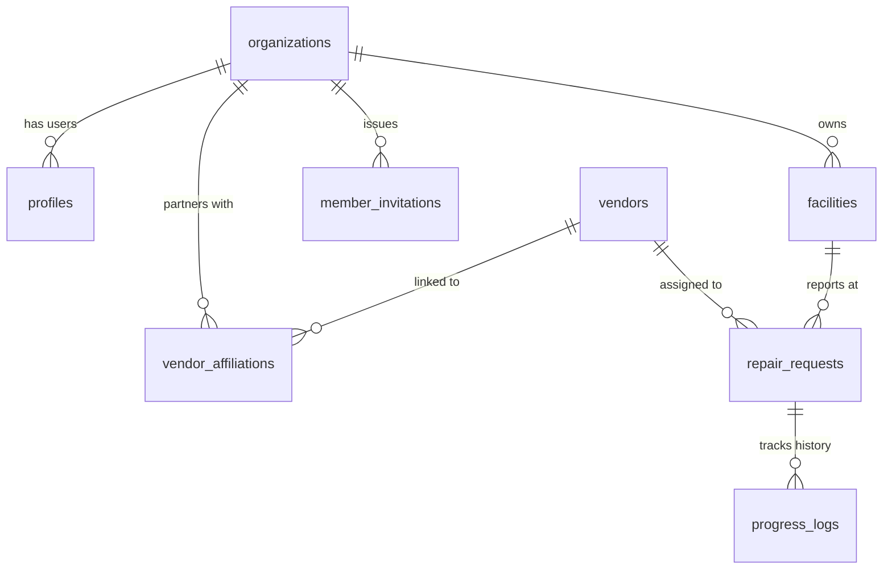

# Product Requirement Document (PRD): FaciliTrack

## 1. Project Overview
FaciliTrack is a premium, multi-tenant facility operations and maintenance management portal designed to streamline the lifecycle of repair requests. The platform connects Tenants (residents), Facility Managers, Organization Admins, Repair Vendors, and SuperAdmins in a secure, real-time environment. 

The application utilizes a hybrid local-first architecture—running in a fully secure Supabase Cloud Mode when API configurations are present, and falling back to a client-side LocalStorage Sandbox Simulation Mode for lightweight staging or offline testing.

---

## 2. User Personas & Permissions

| Persona | Role Scope | Key Operations |
| :--- | :--- | :--- |
| **SuperAdmin** | Global Platform | Registers new Tenant Organizations; provisions OrgAdmins; pre-registers accounts with default passwords; deletes organizations. |
| **OrgAdmin (Admin)** | Organization Level | Manages facilities and vendor profiles; invites managers; updates organization details; reviews dispatches and settles invoices. |
| **Facility Manager** | Organization Level | Manages repair requests; dispatches tasks to partnered vendors; approves completed work; deploys QR codes for resident reporting. |
| **Repair Vendor** | Global Contractor | Signs up via invitation; accepts/declines organization partnership invites; receives job dispatches; submits completion proofs (photo, receipts, cost breakdown). |
| **Tenant (Resident)** | Facility Level | Scans a physical QR code at a facility; submits maintenance tickets with descriptions, coordinates, and photo/video attachments. |

---

## 3. Core Feature Requirements

### 3.1. SuperAdmin Portal
*   **Tenant Onboarding:** Input details for a new organization (Name, Address/Location, Telephone, System Admin details: Name, Email).
*   **Password Pre-Registration:** Optional default password input that automatically creates and confirms the Admin's auth account in Supabase (allowing immediate login without waiting for verification emails).
*   **Active Organizations List:** Real-time visibility and immediate deletion of registered organizations.

### 3.2. Authentication & Password Reset Loop
*   **Public Registration:** Streamlined sign-up forms for Invited Managers (verifies pending email invites) and Contractors (creates a new profile).
*   **Recover Password Loop:** "Forgot Password?" links that trigger Supabase recovery emails. Detects recovery hashes on redirection (`#access_token=...&type=recovery`) to present a secure password update form.

### 3.3. Facility Management & QR Code Dispatch
*   **Dynamic Onboarding:** Create facilities with names, physical addresses, and operational descriptions.
*   **QR Deployments:** Generate printable PDF flyers and QR codes linked to client-side reporting routes (`/report?facilityId=...&orgId=...`).
*   **SPA Route Rewrites:** Configured URL redirects (`vercel.json`) ensuring direct/external hits to sub-routes do not trigger server 404s.

### 3.4. Maintenance Lifecycle & Job Dispatch
*   **Ticket Submission:** Anonymous, geo-tagged reporting with support for attachments (camera/media uploads).
*   **Vendor Selection:** Match and dispatch tickets to specific vendors based on specialty (e.g., Plumbing, Electrical, HVAC).
*   **Completion Flow:** Vendors upload completion photos, receipts, and an itemized breakdown of expenses (Parts, Labor, Misc).
*   **Inspection & Settlement:** Managers review submitted proofs to approve work or request rework. Approved requests can be settled with digital payouts.

---

## 4. Technical Architecture & Data Model

### 4.1. Key Tables & Schemas
*   **`organizations`:** Houses name, logo, theme colors, address, and telephone contacts.
*   **`profiles`:** Connects authentication UUIDs with domain-level roles (`superadmin`, `admin`, `manager`, `vendor`, `tenant`), organizations, and vendor entities.
*   **`facilities`:** Details specific physical properties.
*   **`vendors`:** Contains contractor details, specialties, contact info, and approval states.
*   **`vendor_affiliations`:** Many-to-many lookup table connecting vendors to client organizations.
*   **`member_invitations`:** Tracks pending manager invites.
*   **`vendor_invitations`:** Tracks organization partnership requests sent to contractors.
*   **`repair_requests`:** Holds ticket states (`pending`, `assigned`, `in-progress`, `completed`, `paid`), reporter info, geo-coordinates, completion proofs, and financial costs.
*   **`progress_logs`:** Auditable chronological timeline entries of ticket state changes.

---

## 5. Security & Row-Level Security (RLS)

All tables have RLS enabled. Policy definitions ensure:
1.  **Multi-Tenant Isolation:** Admins and managers can only read, write, or delete rows associated with their `organization_id`.
2.  **Vendor Operations:** Authenticated vendors can see requests assigned specifically to them, insert/delete their own affiliations, and update their own partnership invitations.
3.  **Public Signups:** Anonymous users can query `member_invitations` to verify an invitation and insert new contractor profiles in `vendors` during signup.
4.  **Bypass Recursion:** Security Definer functions (`get_user_org()`, `get_user_vendor()`) are used to check user profiles and break RLS policy evaluation loops.

---

## 6. Design System & User Experience
*   **Theme:** Default premium dark-themed layout with glassmorphism (`backdrop-blur`), glowing buttons, and dynamic state colors.
*   **Icons:** Consistent use of `lucide-react`.
*   **Micro-interactions:** Smooth animations (`fadeIn`, `slideUp`), tooltips, and non-intrusive toast notification alerts.
